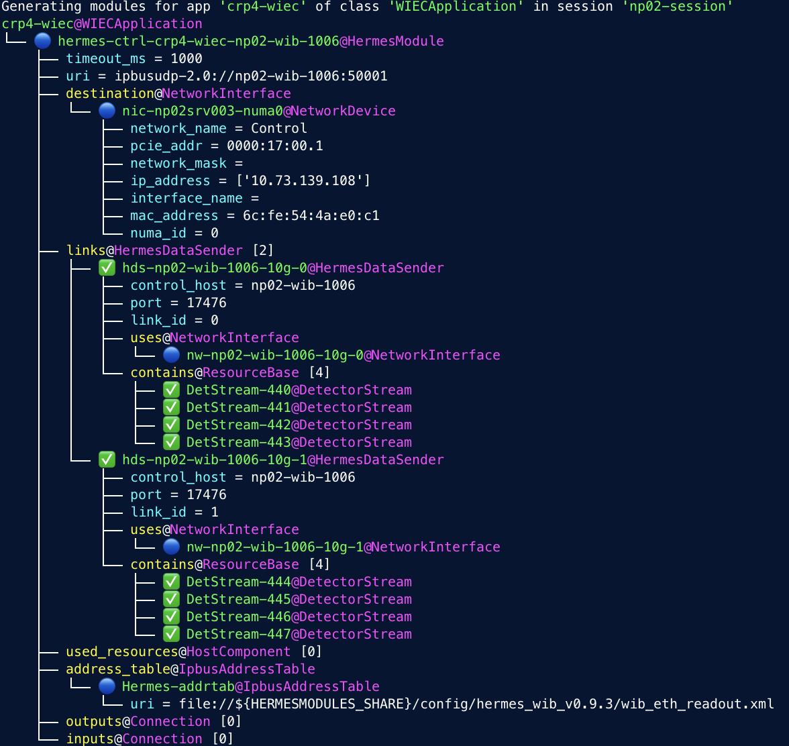

# DAQ Configuration Inspector

:warning: `daqconf_inspector` is in active development and is likely to evolve significantly the near future. :warning:

`daqconf_inspector` is a commandline utility created to explore new ways to visualize and verify DAQ configurations and the objects they contain.
`daqconf_inspector` provides a set of commands to probe different aspects of a configuration database. The commands are accessible using with the usual syntax 

```
daqconf_inspector [OPTIONS] CONFIG_FILE COMMAND [ARGS]...
```

where `CONFIG_FILE` is the path to the configuration database being inspected.
Detailed help is available for each command (including `daqconf_inspector` via the `-h/--help` flags).

### Usage
```
daqconf_inspector [OPTIONS] CONFIG_FILE COMMAND [ARGS]...

Options:
  -i, --interactive  Start an interactive IPython session after executing the
                     commands
  -h, --help         Show this message and exit.

Commands:
  list-classes           List known classes and objects for each class
  show-object-tree       Show relationship tree
  show-objects-of-class  Show properties of objects belonging to a class
  show-sessions          Show sessions information
  show-smartapp-mods     Shows the modules generated by a smart application
  verify-detstreams      Verify detector streams in the database
  verify-smart-apps      Verify smart applications in database
  ```

## Inspection
### `list-classes`

Displays the list of classes known to the schema loaded fom the database, together with the
ids of objects belonging to that class fond in the database.

```
Usage: daqconf_inspector CONFIG_FILE list-classes [OPTIONS]

Options:
  -d, --show-derived-objects-as-parents
                                  Include derived objects in parent class
                                  listing
  -h, --help                      Show this message and exit.
```
|**Example**|
|---|
|`daqconf_inspector ./ehn1-daqconfigs/sessions/np02-session.data.xml list-classes`|
||

### `show-object-tree`

Show the relationship tree of the OKS object with identifier UID.

UID is the unique object identifier in the database, composed by object name and class name. 
The UID format argument is <object name>@<class>.

Starting from the selected object, attributes and objects refererd by relationships are shown recursively as hierarchical tree.
By default the command recursively crawls through relationship without limits. The recursion level can be limited with the corresponding optional parameter (see below).
In case focussing on a relationship branch is helpful, the focus path option (see below for details) allows to specify the branch to focus on, starting trom the top object.
If a focus path is specified, the recursion level is applied starting from the last element of the focus path.
The focus path syntax combines relationhsip and object names, using `.` separators, and `[]` to select a single item in multi-value relatiosnips.
The structure of the focus path specifier is `<relationship>[<optional object name>].<relationship>[<optional object name>]`.
Note: specifiying the object name is required 

```
Usage: daqconf_inspector CONFIG_FILE show-object-tree [OPTIONS] UID

Options:
  +a, --show-attributes / -a, --hide-attributes
                                  Show/Hide attributes
  -l, --level INTEGER             Recursion level in the object tree
  -f, --focus TEXT                Path within the object relationships to
                                  focus on
  -h, --help                      Show this message and exit.
```

|**Example**|
|---|
|`daqconf_inspector ./ehn1-daqconfigs/sessions/np02-session.data.xml show-object-tree df-03@DFApplication  -f network_rules[td-trb-net-rule].descriptor -l 6`|
||


### `show-objects-of-class`

Show attributes and relationships of all objects in the database belonging to KLASS


```
Usage: daqconf_inspector CONFIG_FILE show-objects-of-class
           [OPTIONS] KLASS

Options:
  -v, --vertical / -h, --horizontal
                                  Toggle vertical or horizontal orientation
  --help                          Show this message and exit.
  ```

|**Example**|
|---|
|`daqconf_inspector ./ehn1-daqconfigs/sessions/np02-session.data.xml show-objects-of-class Segment`|
||

### `show-objects-of-class`


### `show-smartapp-mods`

Executes the generate modules method for the selected smart application and session, and displays the results as a hierarchical tree.
Resource objects are displaied with their status.

In case visualising a single relationship branch is desired, the focus path option (see below for details) allows to specify the branch to focus on, starting trom the top object.
If a focus path is specified, the recursion level is applied starting from the last element of the focus path.
The focus path syntax combines relationhsip and object names, using `.` separators, and `[]` to select a single item in multi-value relatiosnips.
The structure of the focus path specifier is `<relationship>[<optional object name>].<relationship>[<optional object name>]`.
Note: specifiying the object name is required .


**Legend**
  
| Icon  | Meaning|
|---|---|
| ✅ | Resource enabled |
| ❌ | Resource directly disabled (included in the Session disable list) |
| ⭕️ | Resource indirectly disabled by algorithm |
| 🔵 | Not a resource |

|**Example**|
|---|
|`daqconf_inspector ehn1-daqconfigs/sessions/np02-session.data.xml show-smartapp-mods np02-session crp4-wiec -f hermes-ctrl-crp4-wiec-np02-wib-1006 -l 2`|
||


## Verification
### `verify-detstreams`

Performs basic validation of detector datastreams in a database.

It checks the collection of all detastreans in the database for uiniqueness.
It also checks that all geo_ids references by detecor streams are unique.

### `verify-smart-apps`

Performs basic validation on smart daq applications a database.

Implemented tests:

- *services*: The exposed service consistency between application interface and network rules is checked.
  the services referenced in network rules are compared with the list in the `exposes_service` attribute.
  The tedt fails if any of the network rules services is not present in `exposes_service`.